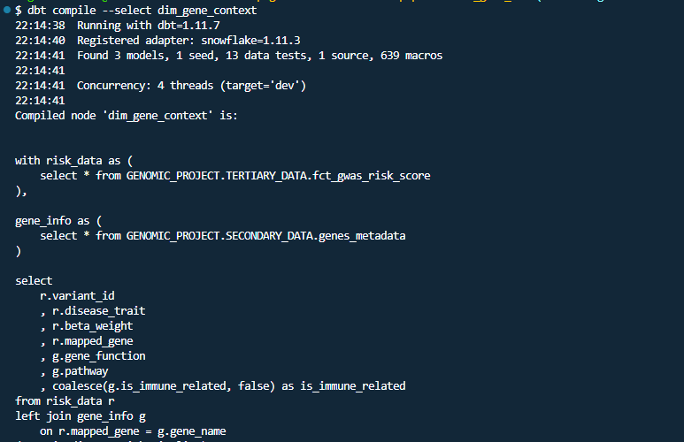

<p align="center">
  
</p>

# HELIOX
*End-to-end Genomic data pipeline for disease risk analysis*

## What This Pipeline Delivers

- Processes **1.1M+ GWAS variants** end-to-end
- Filters statistically significant SNPs (**p ≤ 5e-8**)
- Produces analysis-ready risk datasets in Snowflake
- Enables comparison between **Crohn’s Disease** and **Ulcerative Colitis**
- Fully reproducible pipeline (Docker + Airflow + dbt)

<p align="center">
  
</p>

## Overview

This project implements a data pipeline for processing large-scale genomic data related to **Inflammatory Bowel Disease (IBD)**.
It ingests over **1.1M genetic variants** from the EBI GWAS Catalog and transforms them into structured, analysis-ready datasets using a Medallion Architecture (Bronze, Silver, Gold).
The pipeline applies genome-wide significance filtering (p ≤ 5×10⁻⁸) and organizes the data to support comparison between **Crohn’s Disease (CD)** and **Ulcerative Colitis (UC)**.
The goal is to provide a reproducible and scalable workflow that turns raw genomic data into reliable inputs for downstream analysis.


## Data Architecture

<p align="center">
  
</p>

## Tech Stack

* **Cloud & Infrastructure:** Terraform (IaC)
* **Containerization**: Docker
* **Orchestration:** Apache Airflow (Batch processing)
* **Data Warehouse:** Snowflake
* **Transformation:** dbt
* **Visualization:** Streamlit

## Design Decisions

| Decision | Rationale |
|---------|----------|
| Batch processing (Airflow) | GWAS data is periodic, not real-time |
| Snowflake | Optimized for analytical workloads |
| Medallion architecture | Clear separation of data quality layers |
| dbt | Modular transformations with testing |

## Data Model

### Medallion Architecture
- **Bronze (PRIMARY_DATA)**: Raw GWAS data (~1.1M+ variants)
- **Silver (SECONDARY_DATA)**: Cleaned & filtered (significance p ≤ 5e-8)
- **Gold (TERTIARY_DATA)**: Risk scores, gene annotations, ready for analysis

### Core Models
| Model | Purpose |
|-------|---------|
| `stg_gwas_associations` | Clean & filter raw GWAS data |
| `fct_gwas_risk_score` | Calculate risk scores per disease |
| `dim_gene_context` | Enrich variants with gene annotations |
| `fct_gwas_analysis` | Final analysis-ready dataset |


<p align="left">
  
</p>


## Data Lineage

### Transformation Logic
* Filters genome-wide significant variants (p ≤ 5e-8)
* Converts odds ratios → beta coefficients (ln(OR))
* Maps SNPs to genes
* Enforces data quality via dbt tests

<p align="center">
  
</p>

**Flow**: `stg_gwas_associations` → `fct_gwas_risk_score` + `dim_gene_context` → `fct_gwas_analysis`


## Reliability & Data Quality

### Data Quality Controls
- Genome-wide significance enforced (p ≤ 5e-8)
- Non-null constraints on variant identifiers
- Valid p-value range (0–1)

### Transformation Logic
- SNP normalization (rsID extraction)
- Chromosomal mapping
- Odds ratio → beta conversion (`ln(OR)`)

### Warehouse Optimization
- Clustering keys: `disease_trait`, `ingestion_date`

### Pipeline Reliability
- Idempotent ingestion (safe re-runs)
- Exception logging with full stack traces
- Environment-based configuration

## Testing

- **Current Coverage**: 90% (ingestion module) 
- **Total tests**: 21 tests organized into 7 test classes  

<p align="left">
  
</p>

### Running Tests

```bash
# Install test dependencies
pip install pytest pytest-cov pytest-mock

# Run all tests
pytest tests/ -v

# Run with coverage report
pytest tests/ --cov=ingestion --cov-report=html

# Run specific test class
pytest tests/test_gwas_ingestion.py::TestGWASDataPipelineValidation -v

# Run with markers (only unit tests)
pytest tests/ -m unit -v
```

## Setup & Run

### Prerequisites
- Docker & Docker Compose installed
- Snowflake account
- Ports 8080, 5432, 8501 available

### 1. Clone & Configure
```bash
git clone https://github.com/ingridevv/genomic-disease-risk-pipeline.git
cd genomic-disease-risk-pipeline
cp .env.example .env
```

Edit `.env` and add your Snowflake account details:

```bash
SF_ACCOUNT=xy12345.us-east-1      # Account ID from: Snowflake Console → Admin → Account
SF_USER=your_username
SF_PASSWORD=your_password
SF_WAREHOUSE=GENOMIC_WH
SF_DATABASE=GENOMIC_PROJECT
SF_SCHEMA=PRIMARY_DATA
SF_GOLD_LAYER=TERTIARY_DATA
SF_ROLE=ACCOUNTADMIN
```

### 2. Provision Infrastructure
If you want automated Snowflake setup: 
```bash
cp terraform/terraform.tfvars.example terraform/terraform.tfvars
# Edit terraform.tfvars with your Snowflake credentials
cd terraform/
terraform init
terraform apply
cd ..
```
> Skip this step if resources already exist.

### 3. Start Services
```bash
docker-compose up -d
```
<p align="left">
  
</p>


### 4. Run Pipeline
Access Airflow: 
```bash
http://localhost:8080
```
- Trigger DAG: gwas_genomic_pipeline_v1
- Wait for: 
  - Ingestion
  - dbt transformations

<p align="left">
  
</p>

### 5. Validate Output
```SQL
SELECT COUNT(*) 
FROM TERTIARY_DATA.FCT_GWAS_RISK_SCORE;
```

### 6. Launch Dashboard
```bash
streamlit run data_viz/app.py
```


## Visualization
<p align="left">
  
</p>

## Trade-Offs & Limitations
* Batch processing introduces latency (no real-time ingestion)
* Snowflake cost may scale with large genomic joins
* Limited to publicly available GWAS datasets
* No streaming or CDC pipeline (future improvement)

## Future Improvements

* **Expand autoimmune diseases**: Medallion model is disease-agnostic — adding Type 1 Diabetes or Rheumatoid Arthritis requires only a new ingestion config.
* **Airflow → Pub/Sub + Dataflow**: Streaming becomes relevant if the pipeline expands to real-time variant calling.
* **Snowflake → BigQuery**: Natural migration path as data volume grows.
* **CI/CD with GitHub Actions**: Automated dbt schema tests on every PR before Snowflake deployment.
* **Docker Compose → Kubernetes (GKE)**: Relevant when parallelising ingestion across multiple GWAS studies.

## Project Structure 

| Component | File | What It Does |
|-----------|------|-------------|
| Ingestion | `ingestion/gwas_ingestion.py` | Downloads GWAS data, loads to Snowflake |
| Orchestration | `dags/gwas_genomic_pipeline.py` | Airflow DAG (ingestion → transformation) |
| Staging | `dbt_gwas_etl/models/staging/stg_gwas_associations.sql` | Cleans & filters raw data |
| Risk Scores | `dbt_gwas_etl/models/marts/fct_gwas_risk_score.sql` | Calculates disease-specific scores |
| Gene Context | `dbt_gwas_etl/models/marts/dim_gene_context.sql` | Adds gene annotations |
| Dashboard | `data_viz/app.py` | Interactive Streamlit app |
| Config | `.env.example` | Template for credentials |
| Docker | `docker-compose.yaml` | Service setup (Airflow, Postgres) |
| Infrastructure | `terraform/` | Infrastructure provisioning |

## Common Issues & Solutions

| Problem | Solution |
|---------|----------|
| **Docker containers won't start** | Check Docker is running. Verify ports 8080, 5432 are free. |
| **Airflow can't connect to Snowflake** | Verify `.env` has correct account format (account.region), not `account.snowflakecomputing.com` |
| **dbt transformation fails** | Check Snowflake role has CREATE TABLE privilege. Or run: `terraform apply` |
| **No data in Streamlit** | Verify ingest task ran (check Airflow logs). Query tables in Snowflake directly. |
| **"Warehouse doesn't exist"** | Create manually in Snowflake UI or run Terraform. Update `.env` to match. |
| **"dbt problems"** | Run dbt debug. |


## Dataset

- [EBI GWAS Catalog](https://www.ebi.ac.uk/gwas/)


---
**Built for Data Engineering Zoomcamp 2026**