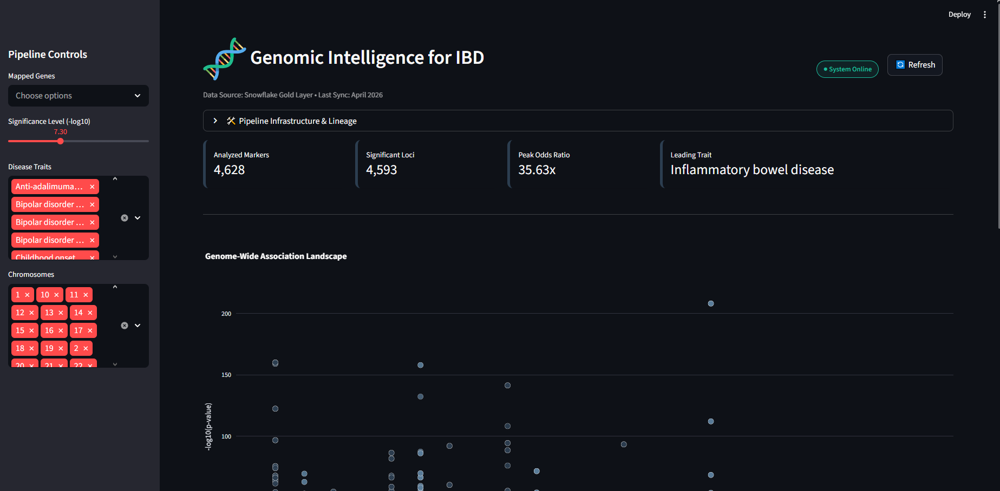
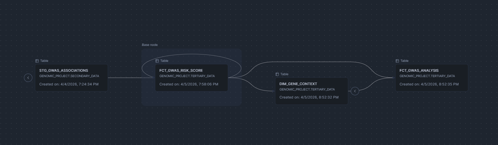

<p align="center">
  
</p>

# HELIOX
**Hereditary Evidence & Loci Integration eXploration**
*Discovering genetic variants and disease risk through data engineering*

---

## Project Overview

**HELIOX** is a production-grade, automated data engineering framework architected to facilitate the large-scale analysis of genetic susceptibility in **Inflammatory Bowel Disease (IBD)**. By implementing a cloud-native **Medallion Architecture**, the system orchestrates the ingestion and transformation of over **1.1M+ genetic variants**, specifically targeting the molecular overlap and distinct loci between **Crohn’s Disease (CD)** and **Ulcerative Colitis (UC)**.

The framework addresses the computational bottleneck inherent in genomic research by deploying a reproducible pipeline that automates the ingestion of high-dimensional data from the EBI GWAS Catalog. It applies stringent statistical rigor ($p \le 5 \times 10^{-8}$) and cross-references loci with known IBD risk profiles, providing a high-integrity analytical foundation for precision medicine and bioinformatics research.

### Strategic Impact & Clinical Relevance
* **Multi-Phenotype Orchestration**: Employs containerized DAGs (Airflow + Docker) to categorize variants across the CD and UC spectrums, enabling comparative genomic analysis.
* **Algorithmic Governance**: Ensures scientific validity through dbt-driven assertions, validating the integrity of odds ratios (OR) and effect sizes across the **Medallion layers**.
* **Pathophysiological Discovery**: Accelerates the identification of risk loci within the IL-23/Th17 pathway and other IBD-specific biological markers through a high-throughput visualization layer.

---

### Data Landscape & Variant Ingestion

* **Source & Genomic Depth**: Systematic extraction of **1.1M+ variants** from the EBI GWAS Catalog (January 2026), focused on non-synonymous SNPs associated with chronic intestinal inflammation.
* **Bioinformatics Pipeline**: High-performance processing of compressed VCF/TSV payloads, utilizing modular Python components for efficient memory management during large-scale extraction.
* **Analytical Scalability**: Implementation of **Clustering Keys** in Snowflake based on genomic coordinates and disease traits, significantly reducing latency for complex queries on IBD-associated loci.

---

## Architecture & Technologies

* **Cloud & Infrastructure:** Terraform (IaC), Docker & Docker Compose.
* **Orchestration:** Apache Airflow 2.8.1 (Batch processing).
* **Data Warehouse:** Snowflake (Medallion Architecture).
* **Transformation:** dbt (SQL-based modeling).
* **Visualization:** Streamlit (Interactive dashboarding).

---

## Key Engineering Features

| Feature | Technical Implementation |
| :--- | :--- |
| **Infrastructure as Code** | **Terraform** — Full cloud resource provisioning and environment reproducibility. |
| **Containerization** | **Docker** — Isolated environments for ingestion scripts and orchestration services. |
| **Workflow Orchestration** | **Apache Airflow** — Automated scheduling of Python extraction and dbt workloads. |
| **Data Warehousing** | **Snowflake** — Implementation of a 3-layer Medallion architecture (Bronze, Silver, Gold). |
| **Performance Tuning** | **Snowflake Clustering** — Query optimization via clustering keys on `disease_trait` and `rsID`. |
| **Data Transformation** | **dbt (Data Build Tool)** — Modular SQL modeling with incremental loads and built-in testing. |
| **BI & Analytics** | **Streamlit** — Custom dashboard for high-throughput genomic data exploration and PRS scoring. |

---

## Data Visualization

The final analytical layer is exposed via an interactive **Streamlit** dashboard, allowing researchers to explore the genomic landscape and risk scores in real-time.

<p align="center">
  
</p>


## Quick Start (5 Steps, ~10 Minutes)

### Prerequisites
- ✅ Docker & Docker Compose installed
- ✅ Snowflake account (trial eligible)
- ✅ Ports 8080, 5432, 8501 available

### Start the Pipeline

**1. Clone, Configure, & Start Services**
```bash
git clone https://github.com/ingridevv/genomic-disease-risk-pipeline.git
cd genomic-disease-risk-pipeline
cp .env.example .env
# Edit .env with your Snowflake credentials
docker-compose up -d
```
✅ **Expected**: Airflow container running (check: `docker ps`)

**2. Access Airflow UI** (~30 seconds after startup)
- URL: http://localhost:8080
- Username: `admin`  |  Password: `admin`

✅ **Expected**: Airflow dashboard loads with "gwas_genomic_pipeline_v1" DAG visible

**3. Trigger the Pipeline**
- Click on DAG → Click **Trigger DAG** button
- Monitor: ingest_task → dbt_transformations (2-5 minutes)

✅ **Expected**: Both tasks turn green (success)

**4. Verify Results in Snowflake**
```sql
SELECT COUNT(*) FROM TERTIARY_DATA.FCT_GWAS_RISK_SCORE;
```
✅ **Expected**: ~20,000+ rows loaded

**5. View Dashboard** (Optional)
```bash
streamlit run data_viz/app.py
```
✅ **Expected**: Dashboard opens at http://localhost:8501

---

## How It Works

### Data Flow
```
EBI FTP → Python Ingestion → Snowflake (Raw)
                              ↓
                         dbt Transform
                              ↓
                         Snowflake (Gold)
                              ↓
                         Streamlit Dashboard
```

### Three Layers (Medallion Pattern)
- **Bronze (PRIMARY_DATA)**: Raw GWAS data (1.1M+ variants)
- **Silver (SECONDARY_DATA)**: Cleaned & filtered (significance p ≤ 5e-8)
- **Gold (TERTIARY_DATA)**: Risk scores, gene annotations, ready for analysis

### Key Models
| Model | Purpose |
|-------|---------|
| `stg_gwas_associations` | Clean & filter raw GWAS data |
| `fct_gwas_risk_score` | Calculate risk scores per disease |
| `dim_gene_context` | Add gene annotations & pathways |
| `fct_gwas_analysis` | Final analysis-ready view |

---
<details>
<summary><b>Data Models Deep Dive</b></summary>

### Staging Layer: `stg_gwas_associations`
**File**: dbt_gwas_etl/models/staging/stg_gwas_associations.sql

- **Materialization**: Incremental view (merge strategy)
- **Key Transformations**:
  - Variant ID extraction (rsID/SNP identifiers)
  - Chromosomal position mapping
  - Odds ratio → beta weight conversion: `beta = ln(odds_ratio)`
  - Genome-wide significance filter: `p_value ≤ 5e-8` (standard for GWAS)
  - Gene mapping for downstream enrichment
- **Clustering Key**: `disease_trait`, `ingestion_date`
- **Quality Tests**: Unique variant_id, not-null on critical fields

---
### Data Lineage & Transformation DAG

The following diagram shows how data flows through our dbt transformation models:

<p align="center">
  
</p>

**Flow**: `stg_gwas_associations` → `fct_gwas_risk_score` + `dim_gene_context` → `fct_gwas_analysis`
</details>
---

<details>
<summary><b> Testing & Quality Assurance</b></summary>

<p align="left">
  
</p>


### Running Tests

```bash
# Install test dependencies
pip install pytest pytest-cov pytest-mock

# Run all tests
pytest tests/ -v

# Run with coverage report
pytest tests/ --cov=ingestion --cov-report=html

# Run specific test class
pytest tests/test_gwas_ingestion.py::TestGWASDataPipelineValidation -v

# Run with markers (only unit tests)
pytest tests/ -m unit -v
```

### Test Coverage

**Current Coverage**: 90% of ingestion module  
**Test Count**: 21 comprehensive tests organized into 7 test classes  
**Status**: ✅ All tests passing

### Test Categories

| Category | Tests | Purpose |
|----------|-------|---------|
| **Metadata** | 3 | Column normalization, data integrity |
| **Validation** | 4 | Data quality, GWAS standards compliance |
| **Initialization** | 3 | Pipeline setup, environment configuration |
| **Download** | 2 | EBI FTP connectivity, ZIP extraction |
| **Load** | 3 | Snowflake connection, data writing, exception logging |
| **Integration** | 3 | End-to-end pipeline orchestration, error handling |
| **Data Quality** | 3 | GWAS significance thresholds, volume validation |

### Key Test Assertions

✅ **Genomic Data Quality**:
- Variant identifiers are never null
- P-values are within plausible range (0-1)
- Genome-wide significance threshold enforced (p ≤ 5e-8)

✅ **Pipeline Reliability**:
- Column normalization for Snowflake compatibility
- Connection creation and error handling
- Data volume validation (minimum records)
- Exception logging with full stack traces (`exc_info=True`)

✅ **Integration Flow**:
- Download → Transform → Load orchestration
- Mock Snowflake interactions
- Environment variable dependency injection
- Graceful error handling with exit codes
</details>
---

## Setup & Configuration

> 💡 **Quick Tip**: Save 5 minutes by gathering your Snowflake credentials before starting.

### Step 1: Clone and Setup Environment
```bash
git clone https://github.com/ingridevv/genomic-disease-risk-pipeline.git
cd genomic-disease-risk-pipeline
cp .env.example .env
```

### Step 2: Configure Snowflake Credentials

Edit `.env` and add your Snowflake account details:

```bash
SF_ACCOUNT=xy12345.us-east-1      # Account ID from: Snowflake Console → Admin → Account
SF_USER=your_username
SF_PASSWORD=your_password
SF_WAREHOUSE=GENOMIC_WH
SF_DATABASE=GENOMIC_PROJECT
SF_SCHEMA=PRIMARY_DATA
SF_GOLD_LAYER=TERTIARY_DATA
SF_ROLE=ACCOUNTADMIN
```

### Step 3: Setup dbt Profiles (Optional, for local dbt use)
If running dbt locally (not via Docker):
```bash
cp dbt_gwas_etl/profiles.yml.example dbt_gwas_etl/profiles.yml
# Edit profiles.yml to use your .env values (via environment variables)
```

### Step 4: Setup Terraform (Optional, for IaC)
To provision Snowflake resources automatically:
```bash
cp terraform/terraform.tfvars.example terraform/terraform.tfvars
# Edit terraform.tfvars with your Snowflake credentials
cd terraform/
terraform init
terraform apply
cd ..
```

> **Note**: If you manually created Snowflake resources, skip Step 4. Or let dbt create them on first run.

---

## Reproducibility

When cloning a fresh copy, everything is included via:
- ✅ `.env.example` - Environment variable template
- ✅ `dbt_gwas_etl/profiles.yml.example` - dbt Snowflake configuration template
- ✅ `terraform/terraform.tfvars.example` - Terraform variables template
- ✅ `docker-compose.yaml` - All services pre-configured
- ✅ All Python, dbt, and Terraform code (no credentials hardcoded)

---

## File Reference

| Component | File | What It Does |
|-----------|------|-------------|
| Ingestion | `ingestion/gwas_ingestion.py` | Downloads GWAS data, loads to Snowflake |
| Orchestration | `dags/gwas_genomic_pipeline.py` | Airflow DAG (ingestion → transformation) |
| Staging | `dbt_gwas_etl/models/staging/stg_gwas_associations.sql` | Cleans & filters raw data |
| Risk Scores | `dbt_gwas_etl/models/marts/fct_gwas_risk_score.sql` | Calculates disease-specific scores |
| Gene Context | `dbt_gwas_etl/models/marts/dim_gene_context.sql` | Adds gene annotations |
| Dashboard | `data_viz/app.py` | Interactive Streamlit app |
| Config | `.env.example` | Template for credentials |
| Docker | `docker-compose.yaml` | Service setup (Airflow, Postgres) |
| Infrastructure | `terraform/` | Snowflake database setup (optional) |

---

## Common Issues & Solutions

| Problem | Solution |
|---------|----------|
| **Docker containers won't start** | Check Docker is running. Verify ports 8080, 5432 are free. |
| **Airflow can't connect to Snowflake** | Verify `.env` has correct account format (account.region), not `account.snowflakecomputing.com` |
| **dbt transformation fails** | Check Snowflake role has CREATE TABLE privilege. Or run: `terraform apply` |
| **No data in Streamlit** | Verify ingest task ran (check Airflow logs). Query tables in Snowflake directly. |
| **"Warehouse doesn't exist"** | Create manually in Snowflake UI or run Terraform. Update `.env` to match. |
| **"dbt problems"** | run dbt debug. |

---

## Next Steps

After the pipeline runs successfully:

1. **Explore the data**
   - Query TERTIARY_DATA schema in Snowflake
   - Check row counts: `FCT_GWAS_RISK_SCORE`, `DIM_GENE_CONTEXT`

2. **Customize the pipeline**
   - Add new disease filters in `dbt_gwas_etl/macros/filter_by_disease.sql`
   - Create new dbt models in `dbt_gwas_etl/models/marts/`
   - Modify Streamlit dashboard in `data_viz/app.py`

3. **Scale up**
   - Increase Snowflake warehouse size (GENOMIC_WH)
   - Adjust dbt threads in `.env` (DBT_THREADS)

---

## Contributing

1. Create a feature branch
2. Make changes
3. Test dbt models: `dbt test`
4. Push and submit a pull request

---

## Resources

- [EBI GWAS Catalog](https://www.ebi.ac.uk/gwas/)
- [Airflow Documentation](https://airflow.apache.org/docs/)
- [dbt Docs](https://docs.getdbt.com/)
- [Snowflake SQL](https://docs.snowflake.com/)
- [Streamlit Guide](https://docs.streamlit.io/)

---

**Project Developed during Data Engineering Zoomcamp 2026**